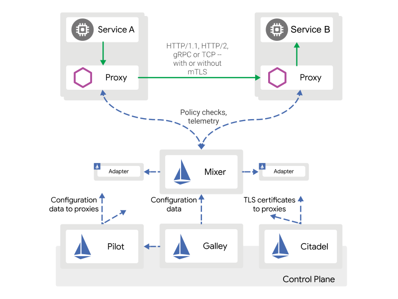
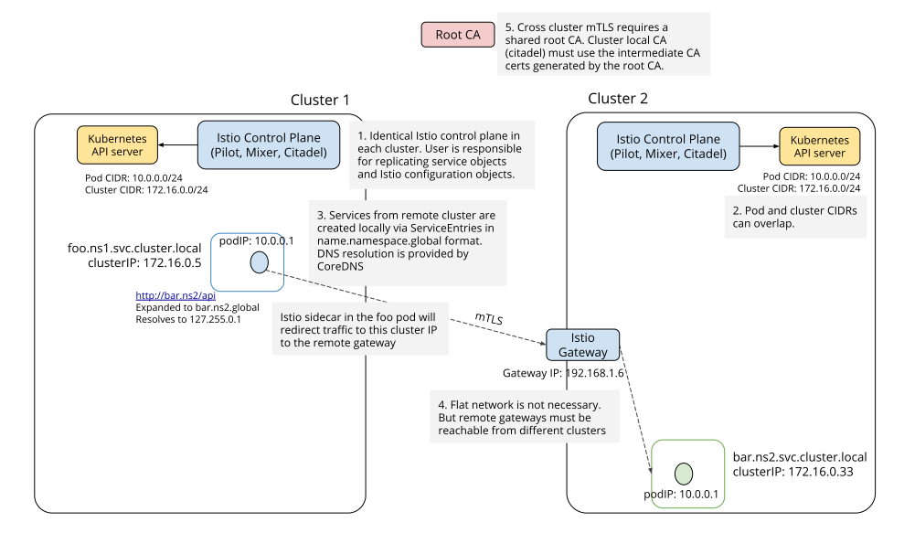
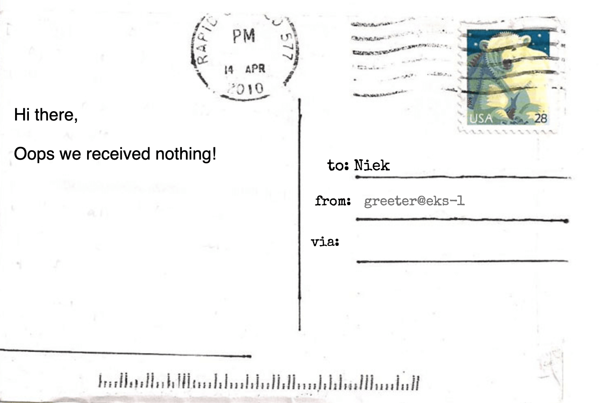
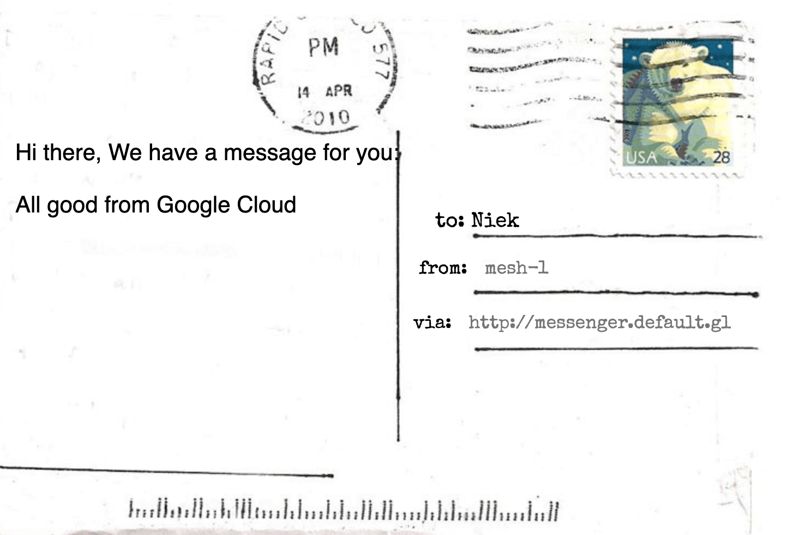

# A multi cloud service mesh with Istio

*This post guide you to create a multi cloud service mesh with Istio on Kubernetes clusters in Amazon and Google cloud.*

<p style="text-align: right">
  <a href="https://github.com/npalm/cross-cluster-mesh-postcard" target="sourcecode">
  <i class="fab fa-github" style="font-size: 200%">&nbsp;</i>Source code for this post</a></p>

## Introduction
The last years we have seen a huge adoption of micro services architectures. Typically micro services brings a lot ff benefits such as flexibility, modularity, autonomy. But deploying and managing micro services architectures brings other difficulties. How dow you know what is running, how do you know your services are compliant? Another pattern that we see is that micro services ar typically heavy loaded with common dependencies for logging, authentication, authorization, tracing and many more cross cutting concerns.

A service mesh brings transparency to the chaos of micro services. A mesh can help with implementing, enforcing and managing requirements such as authentication, authorization, traceability and, data integrity. It also provides features as orchestration and collection of telemetry.

There are currently several service meshes out, for example [App Mesh](https://aws.amazon.com/app-mesh/) from Amazon, [Consol](https://www.consul.io/) from HashiCorp, [Linkerd](https://linkerd.io/) from the CNNF and [Istio](https://istio.io/) launched by IBM, Lyft and Google in 2016. Istio is a fully open source solution based on the high performance proxy [Envoy](https://www.envoyproxy.io/).

Another trend in the industry is multi cloud or hybrid cloud. Confusing terms, no clear definitions. But it look likes common sense when we speaking about multi cloud we point to combining public clouds. And hybrid cloud is when you mix and match public with private cloud.

When you start running cross cloud clusters it becomes even harder to manage all your micro services. Be confident that policies are implemented well or compliant. In this multi / hybrid topology, abstraction from cross cutting concerns to a mesh becomes even more important. In this blog we go to build a multi cloud [Kubernetes](https://kubernetes.io/) cluster with an Istio service mesh.


## A bit more about a Service Mesh
Before we diving in building our multi cloud service mesh a few words about how a mesh works. An Istio mesh consists of two parts. A data plane, intelligent proxies (Envoy) deployed as sidecars. These proxies mediate and control the network traffic. The second component is the control plane which manages and configures the proxies, and enforce policies.



To create a cross cluster mesh with Istio there are two topologies. In the first scenario there is a single control plain that controls all the cluster. In the second scenario a single control plain is deployed to every cluster and you have to ensure the same configuration is pushed to each cluster. In this post we will create an example based on the second option, a control plane in every cluster.




## Building a cross cluster mesh
Lets get started with building a multi cloud service mesh. A quite similar similar example as below is available on my [GitHub](https://github.com/npalm/cross-cluster-mesh-postcard). The example on GitHub is scripted with a set of simple shell scripts and created 3 clusters in 2 clouds. For this post we limited our selves to just 2 clusters in 2 clouds.

We will create 2 clusters and install in both clusters the Istio service mesh, one cluster on AWS (EKS) and the second on Google (GKE). For creating clusters you need to setup your environment with the right tools and credentials. For AWS the [AWS CLI](https://docs.aws.amazon.com/cli/latest/userguide/cli-chap-install.html) is required, for Google you need the [Google Cloud SDK](https://cloud.google.com/sdk/). Furthermore you need to install [kubectl](https://kubernetes.io/docs/tasks/tools/install-kubectl/) to interact with Kubernetes. And [helm](https://helm.sh/) as packagem manager for Kubernetes.

### Setup and configure EKS cluster
First we create EKS clusters with `eksctl`. But cluster has a quite minimal configuration. See the page of [weaveworks ekstcl](https://eksctl.io/) or [AWS](https://docs.aws.amazon.com/eks/latest/userguide/eksctl.html) fom more details. Creating a cluster roughly takes 20 minutes. With the command below we create a default EKS cluster, with only one node it's own VPC.

```
export KUBECONFIG=kubeconfig-istio-1.config
export CLUSTER_NAME=mesh-1
eksctl create cluster \
  --name $CLUSTER_NAME \
  --region eu-central-1 \
  --version 1.13 \
  --node-type t3.medium \
  --nodes 1 \
  --nodes-min 2 \
  --nodes-max 4 
  --node-ami auto \
  --kubeconfig=$KUBECONFIG \
  --tags "environment=multi-cloud-mesh"

kubectl get nodes
```

You should now have a Kubernetes cluster running on AWS. Next we download, install and configure Istio for our service mesh. In the steps below we use for simplicity the sample certificates provided by the Istio distribution. Should I really mention that you should replace those certificates for a real life setup...

```
# Download Istio
export ISTIO_VERSION=1.1.9
curl -L https://git.io/getLatestIstio | sh -
export PATH="$PATH:$PWD/istio-1.1.9/bin"

# Create namespace and install demo certificates 
kubectl apply -f istio-$ISTIO_VERSION/install/kubernetes/namespace.yaml
kubectl create secret generic -n istio-system cacerts \
  --from-file=istio-$ISTIO_VERSION/samples/certs/ca-cert.pem \
  --from-file=istio-$ISTIO_VERSION/samples/certs/ca-key.pem \
  --from-file=istio-$ISTIO_VERSION/samples/certs/root-cert.pem \
  --from-file=istio-$ISTIO_VERSION/samples/certs/cert-chain.pem

# Create a service account for helm.
kubectl create -f \
  istio-$ISTIO_VERSION/install/kubernetes/helm/helm-service-account.yaml
helm init --service-account tiller

# Install the Istio resources
helm install istio-$ISTIO_VERSION/install/kubernetes/helm/istio-init \
  --name istio-init --namespace istio-system

```
The last step could take a minute or so, check with `
kubectl get crds | grep 'istio.io' | wc -l` if the Istio custom resources are created. Once finished there should be 53 custom resources created.

The finial step for installing the service mesh is to create the Istio control plan.
```
helm install --name istio --namespace istio-system \
  istio-$ISTIO_VERSION/install/kubernetes/helm/istio \
  --values istio-$ISTIO_VERSION/install/kubernetes/helm/istio/example-values/values-istio-multicluster-gateways.yaml 
```

For thes example we simply enable sidecar injection for every pod in the default namespace.

```
kubectl label namespace default istio-injection=enabled
```

Services in a local Kubernetes share a common DNS suffix (e.g. `svc.cluster.local`). To ba able to route our remote service we have to stub the Kubernetes DNS for the domain name `.glabal`. Service in a remote cluster can then be addressed with the naming convention `<name>.<namespace>.<global>`. Therefore we need to stub the Kubernetes DNS. EKS is using CoreDNS, so we add the config map below.

```
kubectl apply -f - <<EOF
apiVersion: v1
kind: ConfigMap
metadata:
  name: coredns
  namespace: kube-system
data:
  Corefile: |
    .:53 {
        errors
        health
        kubernetes cluster.local in-addr.arpa ip6.arpa {
           pods insecure
           upstream
           fallthrough in-addr.arpa ip6.arpa
        }
        prometheus :9153
        proxy . /etc/resolv.conf
        cache 30
        loop
        reload
        loadbalance
    }
    global:53 {
        errors
        cache 30
        proxy . $(kubectl get svc -n istio-system istiocoredns -o jsonpath={.spec.clusterIP})
    }
EOF
```

The service mesh on EKS is now ready to start serving applications. 


### The Postcard sample application
In this blog post we use a simple polyglot postcards application. It is always fun to write an application in yet another language. The postcard application consists of twe services. The first service is the [greeter](https://github.com/npalm/cross-cluster-mesh-postcard/tree/master/greeter), the greeter is written in NodeJS and generates a webpage with a postcard. The message on the postcard should be provided by the second application, the [messenger](https://github.com/npalm/cross-cluster-mesh-postcard/tree/master/messenger). THe messenger is a Rust application that will run on the second cluster. I returns a string message based on configuration. 


The greeter app will print an error message in case the messenger is not available o. We deploy now the greeter to the Kubernetes cluster on AWS. We create a standard deployment for the pod, a service, a Istio Gateway, and a Istio Virtual service. The Istio resources are created to make the postcard app public available via an ingress. You can check out the configuration files [here](https://github.com/npalm/cross-cluster-mesh-postcard/tree/master/mesh/demo/greeter). During deployment we update the configuration with name of the cluster.

```
# Deploy greeter pod and service
curl -L \
  https://raw.githubusercontent.com/npalm/cross-cluster-mesh-postcard/master/mesh/demo/greeter/greeter.yaml \
  | sed "s/CLUSTER_NAME/${CLUSTER_NAME}/" | kubectl apply -f -

# create gateway for greeter service
kubectl apply -f \
  https://raw.githubusercontent.com/npalm/cross-cluster-mesh-postcard/master/mesh/demo/greeter/gateway.yaml

```

Once deployed we should already be able to see our postcard via a browser. You can construct the URL with the command below. It can taka few minutes before Load Balancer is ready to accept traffic.

```
export ISTIO_INGRESS=$(kubectl -n istio-system \
  get service istio-ingressgateway \
  -o jsonpath='{.status.loadBalancer.ingress[0].hostname}')
open http://${ISTIO_INGRESS}/greeter
```

The postcard shows no message from th second, cluster. But our greeter app is up and running. The next steps is creating the second cluster.




### Setup and configure GKE cluster
For the second cluster we create a GKE cluster on Google Cloud. You can replace by a second cluster in Amazon or one in another cloud. The first step is similar to creating a cluster in AWS but now one in Google. Open a new terminal to avoid conflicting envrionment variables. 

```
export KUBECONFIG=kubeconfig-istio-2.config
export CLUSTER_NAME=mesh-2
gcloud container clusters create \
    --machine-type n1-standard-4 \
    --num-nodes 1 --enable-autoscaling \
    --min-nodes 1 --max-nodes 5 \
    --addons HttpLoadBalancing,HorizontalPodAutoscaling,KubernetesDashboard \
    --cluster-version 1.13 --zone europe-west3-b \
    $CLUSTER_NAME

kubectl create clusterrolebinding mt-admin --user "$(gcloud config get-value core/account)" --clusterrole cluster-admin

kubectl get nodes
```

The cluster will created in roughly 5 minutes. Next you have to install Istio. The steps are exactly the same as above. Only the last step where we configure the DNS is different since GKE use kube-dns instead of core-dns. Execute the command below to stub  the DNS.

```
kubectl apply -f - <<EOF
apiVersion: v1
kind: ConfigMap
metadata:
  name: kube-dns
  namespace: kube-system
data:
  stubDomains: |
    {"global": ["$(kubectl get svc -n istio-system istiocoredns -o jsonpath={.spec.clusterIP})"]}
EOF
```

### The Postcard sample application - part II
On the second cluster we deploy the messenger app that simply sends a message back. The message can be configures via an environment variable. Install the messenger the app with the `kubectl` command below.

```
# Deploy greeter pod and service
curl -L \
  https://raw.githubusercontent.com/npalm/cross-cluster-mesh-postcard/master/mesh/demo/messenger/messenger.yaml \
  | sed "s/MESSAGE_TEXT/All good from Google Cloude/" \
  | kubectl apply -f -
```

Only one step left now. We need to configure the first cluster with a service entry so the mesh knows how to route calls for `messanger.default.global`. We switch back to the terminal where we have created the first cluster on Amazon. And lookup using the kubeconfig from the second cluster the ip address of the ingress loadbalancer. Next we create a service entry.


```
# Lookup the ingress ip address
export CLUSTER_GW_ADDR=$(kubectl \
  --kubeconfig=kubeconfig-istio-2.config \
  get svc --selector=app=istio-ingressgateway -n istio-system \
  -o jsonpath='{.items[0].status.loadBalancer.ingress[0].ip}')
echo $CLUSTER_GW_ADDR

# Create a service entry
kubectl apply -f - <<EOF
apiVersion: networking.istio.io/v1alpha3
kind: ServiceEntry
metadata:
  name: messenger
spec:
  hosts:
  - messenger.default.global
  location: MESH_INTERNAL
  ports:
  - name: http1
    number: 3000
    protocol: http
  resolution: DNS
  addresses:
  - 127.127.42.69
  endpoints:
  - address: $CLUSTER_GW_ADDR
    ports:
      http1: 15443 # Do not change this port value
EOF
```

Now our postcard application should get the message from the second cluster, go back to the browser and refresh the page. You should now see card as below.



That is all you need to do for creating a cross cluster service mesh. 


## Cleanup
The cleanup steps below assume you created fresh cluster and don't use them for hosting other applications. The Amazon cluster was created via `eksctl`. This tool actually create cloud formation stacks in Amazon. Before you delete the stack, you need to delete the load balancer created by Istio. 

```
# Find the load balancer
aws elb describe-load-balancers | jq -r ".LoadBalancerDescriptions[].LoadBalancerName"

# delete the load balancer  
aws elb delete-load-balancer --load-balancer-name <lb-name>
```
Now you can delete the cluster, the deletion is a asynchronous process. Ensure you verify the deletion went well. In case it fails, happens many times to me. Delete the VPC and retry the delete via cloud formation.
```
delete cluster --name mesh-1 --region=eu-central-1
```

For Google Cloud the deletion is very easy. Deletion of the cluster will delete all dependent resources.
```
cloud container clusters delete --zone europe-west3-b $CLUSTER_NAME
```

## Acknowledgements
The example used in the blog is inspired by a great talk from Matt Turner at the KubeCon - CloudNativeCon 2019 in Barcelona. His talk and example is available in the blog post [Cross-cluster Calls Made Easy with Istio 1.1](https://mt165.co.uk/speech/cross-cluster-calls-istio-1-1-kubecon-eu-19/).
