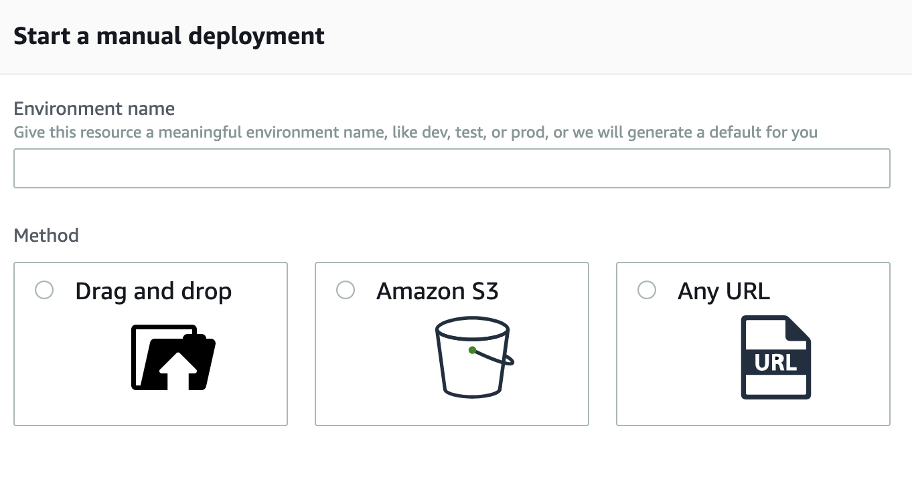

*This post explain how to deploy a branch from a private Git server to AWS Amplify Console for a web application.*

<p style="text-align: right">
  <a href="https://github.com/npalm/aws-amplify-deploy" target="sourcecode">
  <i class="fab fa-github" style="font-size: 200%">&nbsp;</i>Source code for this post</a></p>

## Introduction
Lat year Amazon released Amplify Console, a feature to easily deploy any branch for you web application to the cloud. Connected Git systems are, GitHub, GItLab, BitBucked and CodeCommit. Which limit the usage if you code resides in a self hosted Git. Later they added a manual deploy option to deploy based on a ZIP file that can be uploaded via the web interface or via S3. Let's explore how we can automat the manual option for a self hosted Git server.





## Step 1 - Create your app
The first step is to create you app in Amplify, you can do this in the web console but, we don't like manual steps. So for we we automated this via a simple script.

```bash
export APP_ID=$(aws amplify create-app --name blog | jq -r '.app.appId'
```

The output we capture in a variable `APP_ID` for later use. 

## Step 2 - Create branch
Before you can deploy a branch, we need to crate a branch in Amplify. To avoid we run the command if a the branch already exists we do a quick check. You can also add a password to protect our web app via basic authentication. 

```bash
export 
branch_count=$(aws amplify list-branches --app-id $APP_ID | \
  jq -r '[.branches[] | select(.branchName | contains("'$BRANCH_NAME'") )] | length')

if [[ $branch_count == 0 ]]; then
    basic_auth=$(echo -n blog:somebetterpwd | openssl base64)
    aws amplify create-branch --app-id $APP_ID --branch-name \ 
    $BRANCH_NAME  --enable-basic-auth --basic-auth-credentials $basic_auth
fi
```

## Step 3 - deployment
Finally we can deploy our app. Find a way to deploy automated for the case Amazon call manually was a bit hard due to a lock of documentation and posts. For doing a deployment from a non connected Git (aka manual deployment) you have the option in we web console to provide a public link, upload file, or ink to file in S3. The AWS CLI docs does not mention the S3 option. The post  [Deploy files stored on Amazon S3, Dropbox, or your Desktop to the AWS Amplify Console](https://aws.amazon.com/blogs/mobile/deploy-files-s3-dropbox-amplify-console/) suggest to upload the file ot a S3 and create a lambda that will a deployment for a new file. We choose a slightly different approach. First we send our app as zip to S3.

```bash
yarn build && cd build
zip -r $BRANCH_NAME.zip .
aws s3 cp $BRANCH_NAME.zip s3://$S3_BUCKET_NAME
```

No we need to find a way to trigger the deployment. The option `--source-url` for starting a deployment does not mention tha a S3 url is an option as well. So we tried it and it works perfect.

```bash
aws amplify start-deployment --app-id $APP_ID --branch-name $BRANCH_NAME \ 
  --source-url s3://$S3_BUCKET_NAME/$BRANCH_NAME.zip
```

Another option to do a deployment is via sending the zip archive to a signed S3 link which will be provided if you leave out the `--source-url` option. 

So that is all we have to do for automating a manual deployment. A script snippets shown above a available as an script on [GitHub](https://github.com/npalm/aws-amplify-deploy).

<asciinema-player src="/2019/09/02/automating-the-manual-aws-amplify-deploy/deploy.json"
  cols="180" rows="15" autoplay="true" loop="true" speed="1.5">
</asciinema-player>